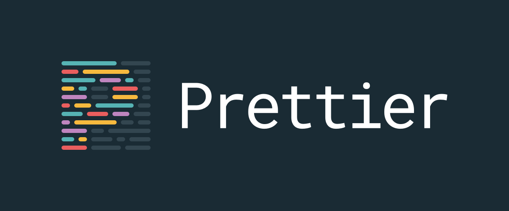
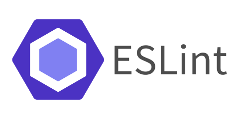

# React Tooling

Now we will dive deep into tooling around tooling around React and modern frontend development in general.

## NodeJS


[Download Page](https://nodejs.org/en/download/)

- NodeJS is a Javascript runtime. It enables you to run javascript outside browser, in your laptop and server.
- React does not need NodeJS (which I have demonstrated in previous section). However, NodeJS is important because it is the environment that enables the tooling that React depends heavily e.g. package management, bundling, transpiling, formating, and linting.

## npm


- npm is the package manager for NodeJS. It is prepackaged together with NodeJS so you usually download them together.
- It hosts packages for NodeJS and all the packages for front-end. npm has a command-line tool, called `npm` as well.
- `npm` allows you to install code from npm registry which are the open-source projects that you can use in your project. When you run `npm install react`, it will download the latest version of React in npm registry to your project.

In order to start an npm project, run `npm init` at the root of your project folder. It will ask you a few questions. If you don't know the answer or don't care, just hit Enter, you can always update it later by editing `package.json` file.

> Install NodeJS if you haven't. In your command line, run `node -v` and `npm -v` to ensure they are installed correctly.

<hr >

## Do It: Create your project

1. create a new folder and call it `intro-to-react`
1. open the `intro-to-react` folder
1. In your command line, enter `npm init` and answer the questions. A file with name `package.json` should be generated in the folder. You can open it to check it - it is a JSON file that captures what you've answered, thus you can edit this file as you wish.
1. move the `index.html` file into the `intro-to-react` folder
1. create a file alongside the html file and call it `script.js`
1. cut and paste our code within `script` tag into `script.js`
1. remove the `script` tag in our html file and replace it with
   ```html
   <script src="script.js"></script>
   ```
1. open the `index.html` file with browser and ensure it still works.

<hr >

## prettier



- Prettier is an opinionated code formatter that removes worries about the style of your code.
- It will takes your code and reformat it based on predefined styles. Since you no longer has control of the style of your code, your code is always consistent, as is the code from the rest of your team.
- To use prettier to format your code, run the following command `npx prettier --write script.js`. Prettier will format code of `script.js`. Try to modify `script.js` and make it look ugly and run `npx prettier --write script.js` again - prettier will make the code back to its format.
- Prettier is great to use with VS code, download this [extension](https://marketplace.visualstudio.com/items?itemName=esbenp.prettier-vscode).

## npm scripts

It can be painful to remember CLI commands to run for your project. npm allows you to define common commands that you run for your project and list it in `package.json`, so you don't need to remember it.

Let's configure npm scripts for the prettier formatting above:

1. Install prettier in your project by running `npm install -D prettier`. The `-D` flag implies prettier will be installed as `devDependencies`.
1. Add the `format` script in your `package.json`:
   ```js
   {
       "name": "intro-to-react",
       ...
       "scripts": {
           "format": "prettier --write script.js"
       }
   }
   ```

Now you can invoke prettier by running `npm run format`.

<hr >

## Do It: add and configure prettier in your project

1. Install prettier and configure format script based on the instruction above.
1. (Optional) Configure prettier plugin if you're using VS code.

<hr >

## ESLint



- ESLint is a linter that enforce some code styles that more to usage than to code styles, e.g. never use `with` or never has unused parameters in your function.
- To use ESLint in your project:
  1. run `npm install -D eslint`
