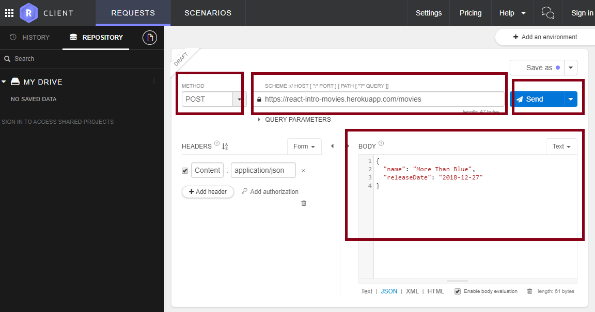

# Bonus - Form in React

This section will be covered if we have additional time during the workshop.

## Allow User to Create Movie

It would be nice if our users can create a movie themselves.

### Prerequisite: API Service for Create Movie

Before you can allow user to create movie, first of all the backend API Service must be able to support that.

Luckily our movies API support that. To able to create a movie, install this [Restlet Client][restlet-client], which is a Chrome extension to allow you to make API calls.

After the extension is installed,

1. open the extension by clicking the icon
1. select "POST" in the METHOD dropdown.
1. enter the following URL in the URL bar:
   ```
   https://react-intro-movies.herokuapp.com/movies
   ```
1. add the following content in the BODY field (change it to your favourite movie):
   ```json
   {
     "name": "More Than Blue",
     "releaseDate": "2018-12-27"
   }
   ```
1. click send



Now when you load your app, you should be see your movie is added.

### Add Ajax Call Function to Make the POST Request

Create a `createMovie` function in `api.js` that will make the request

```js
export const createMovie = movie =>
  axios
    .post('https://react-intro-movies.herokuapp.com/movies', movie)
    .then(res => res.data);
```

### Create Form Component

Let's add a file `movie-form.js`:

```jsx
```

[restlet-client]: https://chrome.google.com/webstore/detail/restlet-client-rest-api-t/aejoelaoggembcahagimdiliamlcdmfm?hl=en
